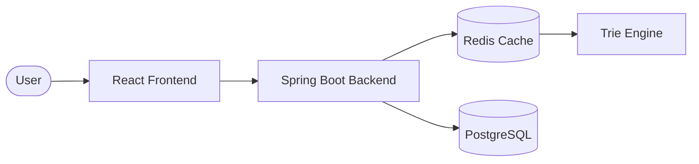
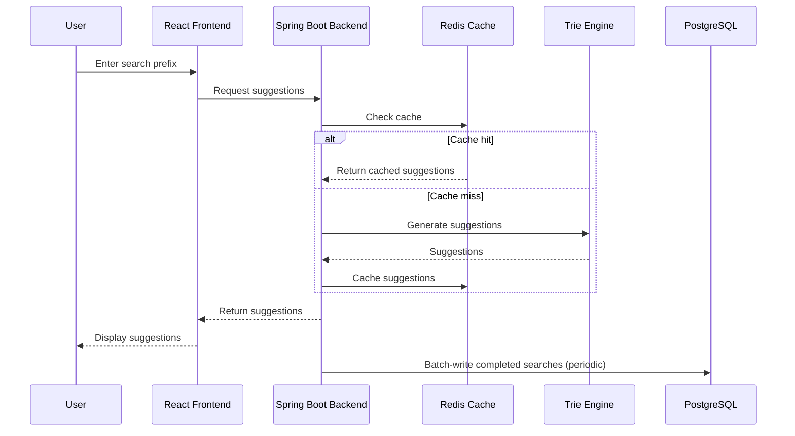

<div align="center">

# Distributed Search Typeahead Engine

A production-inspired autocomplete system built using Spring Boot, React, Redis, PostgreSQL, and Trie-based indexing. The system provides low-latency search suggestions, trending query tracking, caching, and batch processing while operating on a large real-world search dataset.


</div>

---

## Table of Contents

- [Features](#features)
- [Tech Stack](#tech-stack)
- [System Architecture](#system-architecture)
- [Dataset](#dataset)
- [Project Structure](#project-structure)
- [API Endpoints](#api-endpoints)
- [Design Choices](#design-choices)
- [Performance Optimizations](#performance-optimizations)
- [Getting Started](#getting-started)
- [Future Improvements](#future-improvements)
- [Project Highlights](#project-highlights)
- [Author](#author)

---

## Features

- Trie-based autocomplete engine
- Redis caching with cache hit/miss metrics
- PostgreSQL persistence
- Batch processing for efficient database writes
- Trending search calculation
- Consistent hashing simulation
- Real-time search suggestions
- Interactive React dashboard
- Large-scale dataset support (1.24M+ queries)

---

## Tech Stack

| Category | Technologies |
|---|---|
| **Frontend** | React, Bootstrap, Axios |
| **Backend** | Spring Boot, Spring Data JPA, Spring Data Redis |
| **Database & Cache** | PostgreSQL, Redis |
| **Data Structures** | Trie, Consistent Hash Ring |

---

## System Architecture



### Request Flow



1. User enters a search prefix.
2. Backend checks Redis cache.
3. On cache hit, suggestions are returned immediately.
4. On cache miss, suggestions are generated using the Trie.
5. Results are cached for future requests.
6. Completed searches are buffered and periodically written to PostgreSQL.

---

## Dataset

### Source

**AOL User Session Collection 500K**
🔗 https://www.kaggle.com/datasets/dineshydv/aol-user-session-collection-500k

### Dataset Statistics

| Metric | Value |
|---|---|
| Original Dataset | ~20 Million Search Records |
| Processed Queries | 1,243,730 |
| Dataset Type | Real-world search logs |

<details>
<summary><strong>Preprocessing Steps</strong> (click to expand)</summary>

1. Extracted the Query column.
2. Converted queries to lowercase.
3. Removed empty records.
4. Trimmed whitespace.
5. Aggregated duplicate queries.
6. Generated a CSV file containing search queries and frequencies.

</details>

---

## Project Structure

<details>
<summary><strong>Backend/ &amp; Frontend/</strong> (click to expand)</summary>

```
Backend/
├── controller/
├── service/
├── repository/
├── entity/
├── trie/
├── cache/
├── batch/
└── loader/

Frontend/
├── components/
├── services/
└── hooks/
```

</details>

---

## API Endpoints

| Method | Endpoint | Description |
|---|---|---|
| `GET` | `/suggest?q={prefix}` | Returns autocomplete suggestions for a prefix |
| `POST` | `/search` | Records a completed search |
| `GET` | `/trending` | Returns the top trending queries |
| `GET` | `/metrics` | Returns cache hit/miss metrics |
| `GET` | `/status` | Returns current system health information |
| `GET` | `/cache/debug?prefix={prefix}` | Returns cache routing and debugging information |

<details>
<summary><strong>Get Suggestions</strong></summary>

```
GET /suggest?q=iphone
```

Returns autocomplete suggestions for a prefix.

</details>

<details>
<summary><strong>Record Search</strong></summary>

```
POST /search
```

Request:

```json
{
  "query": "iphone 14"
}
```

Records a completed search.

</details>

<details>
<summary><strong>Get Trending Searches</strong></summary>

```
GET /trending
```

Returns the top trending queries.

</details>

<details>
<summary><strong>Get Cache Metrics</strong></summary>

```
GET /metrics
```

Returns:

```json
{
  "cacheHits": 120,
  "cacheMisses": 35,
  "hitRate": 77.42
}
```

</details>

<details>
<summary><strong>Get System Status</strong></summary>

```
GET /status
```

Returns current system health information.

</details>

<details>
<summary><strong>Cache Debug</strong></summary>

```
GET /cache/debug?prefix=iph
```

Returns cache routing and debugging information.

</details>

---

## Design Choices

<details>
<summary><strong>Trie</strong> — used for prefix-based autocomplete</summary>

**Benefits**
- O(k) lookup complexity
- Fast suggestion retrieval
- Independent of dataset size

**Tradeoff**
- Higher memory usage

</details>

<details>
<summary><strong>Redis</strong> — used to cache frequently requested prefixes</summary>

**Benefits**
- Faster response times
- Reduced backend load

**Tradeoff**
- Potential cache staleness

</details>

<details>
<summary><strong>Batch Processing</strong> — search events are written in batches</summary>

**Benefits**
- Fewer database writes
- Better throughput

**Tradeoff**
- Small persistence delay

</details>

<details>
<summary><strong>PostgreSQL</strong> — used for persistent storage and analytics</summary>

**Benefits**
- Reliable storage
- Supports trending calculations

**Tradeoff**
- Slower than in-memory access

</details>

---

## Performance Optimizations

- Trie-based indexing
- Redis caching
- Batch database writes
- Consistent hashing simulation
- Real-world dataset testing

---

## Getting Started

### Prerequisites

- Java 24+
- Maven
- PostgreSQL
- Redis
- Node.js 22+

### Backend

```bash
cd Backend
mvn spring-boot:run
```

Backend runs on **http://localhost:8080**

### Frontend

```bash
cd Frontend
npm install
npm run dev
```

Frontend runs on **http://localhost:5173**

---

## Future Improvements

- Multi-node Redis deployment
- Trie sharding
- Kafka-based event ingestion
- Elasticsearch integration
- Horizontal backend scaling

---

## Project Highlights

- Processed 1.24M+ real-world search queries
- Supports sub-second autocomplete suggestions
- Redis-backed caching with hit/miss monitoring
- Trie-based prefix search implementation
- Batch write optimization for database persistence
- Real-time trending search tracking

  ```

## Author

**Shlok Gupta**
Scaler School of Technology
*Distributed Search Typeahead Engine*
